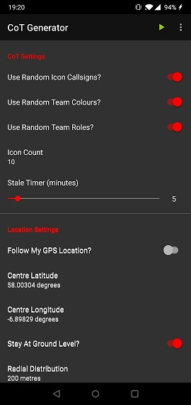

# Cursor On Target Generator

## Note
This is the sister app of [CoT Beacon](https://github.com/jonapoul/cotbeacon). CoT Generator generates fake data, CoT Beacon generates a single self icon only.

## Quick Start
1. Download the installer APK from [the GitHub releases page](https://github.com/jonapoul/cotgenerator/releases), then copy the file to your device and open it in a file browser to install.
2. Open the app and grant permissions for GPS access and reading external storage. See [permissions section](#permissions).
3. Configure as required (see below for more explanation).
4. Tap the green "start" icon in the right hand side of the upper toolbar. This begins the configured packet transmissions.
5. When finished, tap the red "stop" icon on the toolbar, or the "STOP" button on the service notification.

## Screenshots

| Main Screen | Custom Output Presets |
|:--:|:--:|
 |  |

| 20 Icons |
:--:|
|

| 20 Icons, elevated 500m |
:--:|
|

| The end times are nigh... |
:--:|
|

## Function
This app generates a specified number of representative CoT PLI tracks around a configured latitude/longitude point. These tracks are randomly scattered within the configured "Radial Distribution" and are given randomised ATAK callsigns. After each transmission, each track is shifted slightly to a random position dependent on the icon movement speed. CoT Generator is mostly intended for network/server stress testing, but could also be useful for demonstration purposes.

It supports SSL, TCP and UDP traffic, and it will give you a red UI notification if any connection errors occur (timeout, socket closing, etc.).

Similarly, if you're travelling between different networks whilst the server is running (e.g. losing Wi-Fi signal then regaining it), you should expect it to stop running when the connection is lost. Just restart the service and it should work again.

## Settings
| Option | Possible Values | Default Value | Description |
|--------|-----------------|---------------|-------------|
| Use Random Callsigns? | True/False | True | When enabled, icon callsigns will be pulled at random from ATAK's default callsign list. |
| Callsign | Any characters except '<' or '>' | GENERATED | Acts as a base callsign for all generated icons. E.g. "GENERATED-1", "GENERATED-2", etc. |
| Use Random Team Colours? | True/False | True | When enabled, icon colours are pulled at random from ATAK's team colour list. |
| Team Colour | Standard ATAK team colours | Cyan | Colour to be applied to all icons. |
| Use Random Team Roles? | True/False | True | When enabled, icon roles are pulled at random from ATAK's role list. |
| Team Role | Standard ATAK icon roles | Team Member | Role to be applied to all icons. |
| Icon Count | Positive integer | 10 | Number of icons to place on the map. |
| Stale Timer | 1 to 60 | 5 mins | Time after which icons will stale out of the TAK map. |
| Follow My GPS Location? | True/False | True | When enabled, all generated icons will follow your moving GPS position on the ATAK map. |
| Centre Latitude/Longitude | 
0 < longitude < 360 -90 < latitude < 90
 | 
Lat = 53.725103 Lon = -1.351375
 | Specifies the static centrepoint of all generated icons. |
| Stay At Ground Level? | True/False | True | When enabled, all icons are placed at an altitude of 0m HAE (height above ellipsoid). |
| Centre Altitude | 0 to 5km | 0m | Sets the vertical centrepoint of all generated icons. Icons will be distributed in a pseudo-cylinder around the specified lat/lon/HAE coordinates. |
| Radial Distribution | Positive integer | 100m | The radius of the icon distribution circle. Essentially a maximum distance each icon can possibly move from the centrepoint in 3D space. |
| Icon Movement Speed  | Positive integer | 5mph | Speed at which each icon moves from point to point between each update. Note that the directional bearing is random. |
| Transmission Period | 1 to 30 | 10 seconds | Update period for each icon. So if we have Icon Count of 40 and a Transmission period of 10 seconds, we'll send out 4 packets per second. |
| Transmission Protocol | SSL, TCP, UDP | TCP | Network protocol to use when sending out packets. |
| Data Format | XML or Protobuf | Protobuf | The serialisation format of the CoT packet. Note that TAK Servers over TCP/SSL only allow XML (as far as I know!), so the option will be hidden for these protocols. |
| Output Destination | Any default or custom preset | Public FreeTakServer |  |
| Custom Presets... | N/A | N/A | Opens a window to add, edit and delete persisted custom presets for each protocol. See the screenshot at the top. |

## Permissions
Two permissions requested:
- **GPS**: Only used for the "Follow My GPS Position" option, with which each generated icon will follow your GPS location as you move around.
- **Storage**: Only used to read client certificates and trust stores when configurinng custom SSL presets.

## Security
Note that any SSL certificates/passwords loaded into the app are stored in a database in the application's private directory, and the password is in plaintext. Don't expect this to be super high-security!

## Troubleshooting
Note that 100% of testing has been done on a OnePlus 6 running Android 10. If there are any compatibility issues or crashes (I'm sure there are), please raise an issue!

## Acknowledgements
Thanks to the crew at the TAK Discord, most notably [Corvo](https://github.com/brothercorvo) and [Field Mapper](https://github.com/fieldmapper) for hosting their public FreeTAKServer and OG TAK Server respectively, used extensively for testing.
